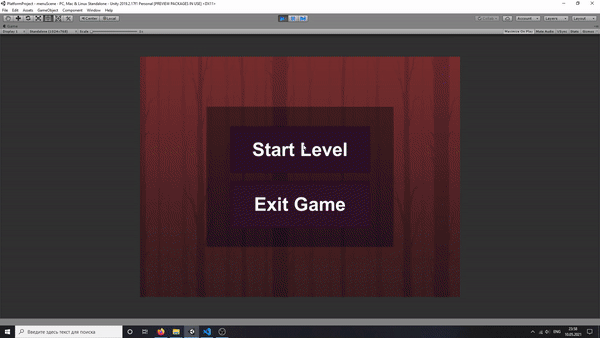
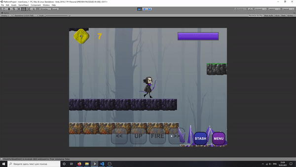
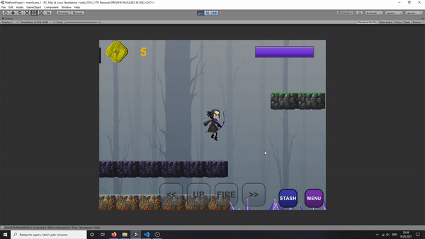
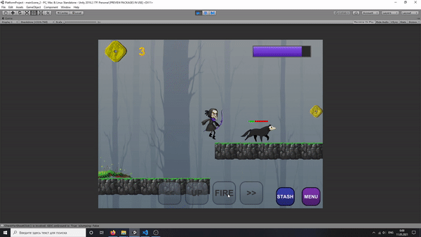
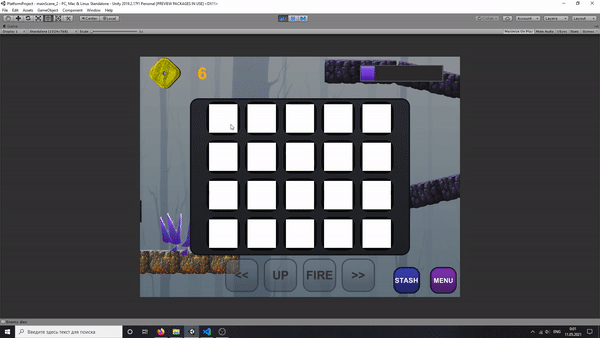

# Description:

This is the training Unity project of making simple platfomer game, that used such technics, as:

1. Animated moves of player and game characters (enemies)
2. Invetory and buff systems
3. Visual effects, local canvas usage
4. Basic UI menu controls
5. Scene loading system

# Contents:

Unity source code with scripts, sprites, animations and game music

# Demo gifs:

